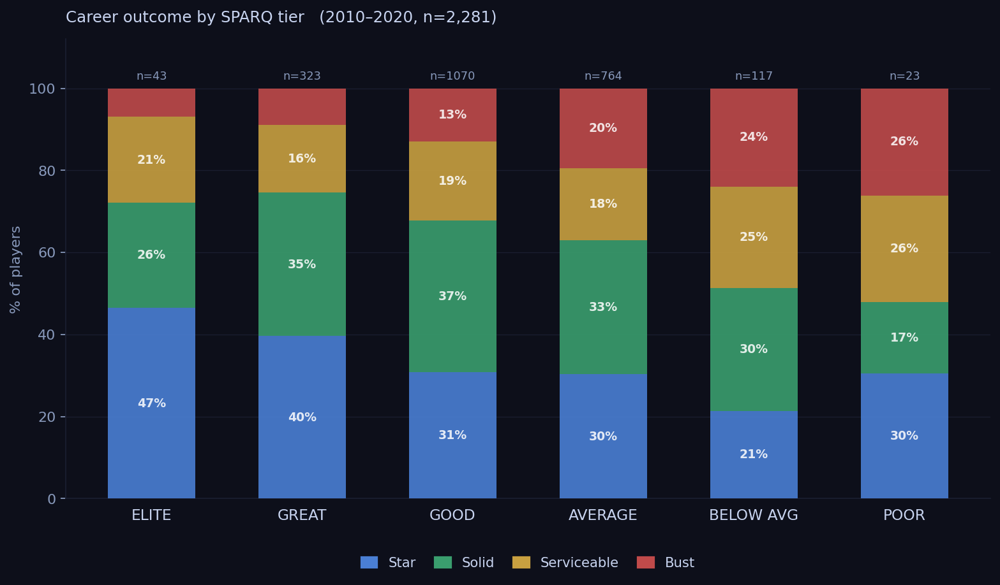
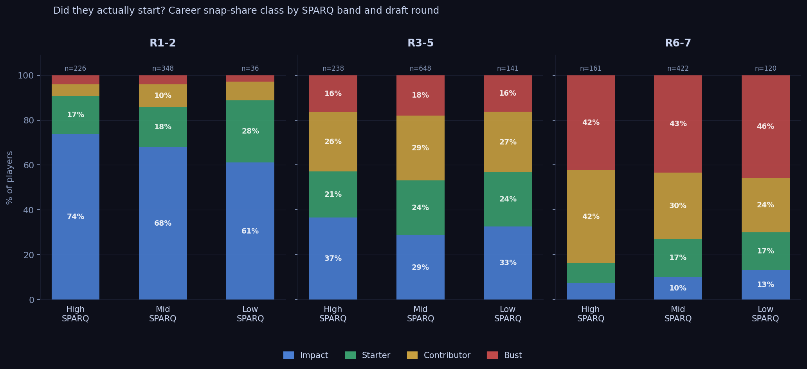
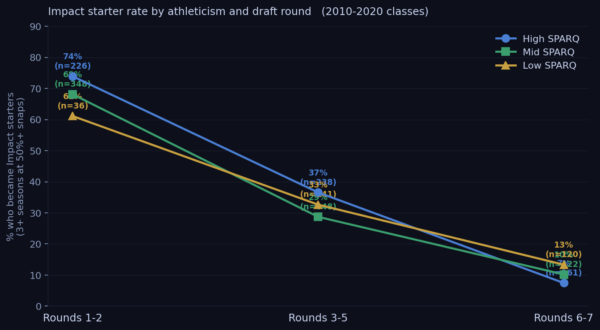
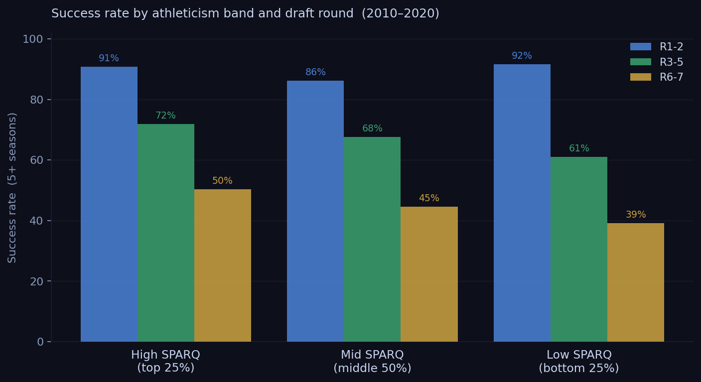

# The $30 Million Question: Does the Combine Predict NFL Starting Careers?

*April 28, 2026*

*We matched 11 years of NFL draft picks to weekly snap share data. The combine predicts starting careers more reliably than the draft discourse admits.*

---

NFL teams spend roughly $30 million in guaranteed money on the average first-round pick. The single best public predictor of whether that investment produces a starter — better than college production, better than team need, better than draft position alone — is how the player tested at the combine.

We looked at 11 years of draft picks, matched them to weekly snap share data, and found a consistent pattern. High-SPARQ athletes become multi-year starters at meaningfully higher rates than low-SPARQ athletes. The gap isn't enormous. It doesn't disappear. And it's largest precisely where it matters most: at positions where athleticism is structurally irreplaceable.

---

## What SPARQ Measures

SPARQ collapses seven combine metrics into a single position-adjusted athleticism score: 40-yard dash, vertical jump, broad jump, shuttle, 3-cone, bench press, and weight. We express it as a z-score — how many standard deviations above or below average a player tests for his specific position.

Zero is exactly average. A z-score of plus 2.0 is the top 2 percent of all historical draftees at that position. Minus 0.674 is the bottom quartile — still physically elite by any normal standard. We're talking about below-average within a population of people who ran a sub-4.7 forty at a Division I program.

For career outcomes, we used snap share rather than roster longevity. Whether a player was on a roster tells you whether a team kept him. Whether he averaged half his team's snaps in a season tells you whether they actually trusted him to play. Those are different things, and for this analysis, the second one matters more.

Four tiers, based on snap share:

| Tier | Definition |
|------|-----------|
| **Impact** | 3+ seasons averaging 50%+ of their team's snaps |
| **Starter** | 1 or 2 seasons averaging 50%+ snaps |
| **Contributor** | Appeared regularly but never averaged 50%+ snaps in a season |
| **Bust** | Fewer than 8 career games with recorded snaps |

We matched 2,340 drafted players from the 2010 to 2020 classes to this snap share database, with an 82% match rate. Classes through 2020 only, so every player in the sample has had at least five seasons to show up.

---

## The Signal Is Real

Start with the aggregate picture. Among the very best combine performers — top 2 percent at their position — 72% went on to long NFL careers. Among the very worst testers, the bottom 2 percent, that drops to 39%. A 33-point gap between the extremes.

The more interesting picture comes from combining SPARQ band with draft round.

| | R1-2 Impact | R3-5 Impact | R6-7 Impact |
|---|---|---|---|
| **High SPARQ** | 74% | 37% | 7% |
| **Mid SPARQ** | 68% | 29% | 10% |
| **Low SPARQ** | 61% | 33% | 13% |

In rounds one and two, High SPARQ players hit a 74% impact rate. Low SPARQ players hit 61%. That's a 13-point gap among players receiving the same draft capital and the same organizational investment. The ones who tested better started more. That's not a coincidence.

The middle rounds hold the same direction. High-SPARQ players in rounds 3-5 become impact starters 37% of the time; Low-SPARQ players get there 33% of the time. The gap narrows, but it doesn't flip.

---

## The Late-Round Wrinkle

Rounds six and seven show something that looks like a reversal: Low SPARQ (13%) outperforms High SPARQ (7%) in impact rate. It isn't a real inversion — it's a selection effect.

High-SPARQ players who fall to round seven are almost always there for a reason. Mental errors, injury history, character flags, scheme fit problems. The athleticism is real and the scouts know it. The film is also real. When a team drafts one of these guys in round seven, they're making a physical projection bet, and those bets fail more often than not.

Low-SPARQ players who survive to round seven and still stick around long enough to become genuine starters are a different kind of player entirely. They're technically skilled and football-smart, and they've compensated for limited physical upside their whole careers. The combine already told you they weren't going to beat anyone with their legs. They knew that too. The ones who made it learned other ways to win.

By round seven, the SPARQ signal has already been priced in. Every team has seen the testing numbers. The round itself is encoding all of that information.

---

## Where It Matters Most

The aggregate numbers smooth over real position-level differences. SPARQ isn't equally predictive everywhere, and pretending otherwise misses the point.

**Outside cornerback** is where you see the hardest floor. Sub-4.40 speed is nearly universal among above-average NFL corners. The route-running disadvantage below that threshold is hard to scheme around and almost impossible to overcome with technique alone. Richard Sherman ran 4.54 at 6'3" and survived partly because his size let him play a physically different kind of coverage — a workaround that doesn't exist for a 5'11" corner running the same time.

**Receiving tight end** has a similar wall around 4.70 in the forty. The position asks for a hybrid athlete in ways that interior OL or linebacker simply don't. There are almost no high-volume receiving tight ends in the historical data who tested that slowly.

**Interior offensive line, quarterback, linebacker, and slot receiver** show much weaker SPARQ effects. These positions are decided more by technique, processing speed, and football IQ, and the outcomes in our data reflect that. The low-SPARQ players who beat the odds are concentrated here.

SPARQ is most predictive where athleticism is the constraint. At positions where it isn't, the z-score matters less.

---

## The Exceptions, and What They Tell You

The low-SPARQ players who became long-term starters are worth naming, because they come up every time anyone argues against combine data:

| Player | Pos | z-score | Round | Career |
|--------|-----|---------|-------|--------|
| Kelvin Beachum | OT | -1.43 | R7 | 15 seasons |
| Jordan Poyer | CB/S | -1.12 | R7 | 14 seasons, 2x Pro Bowl |
| Morgan Moses | OT | -1.42 | R3 | 13 seasons |
| Trent Brown | OT | -1.36 | R7 | 12 seasons |
| Jarvis Landry | WR | -2.07 | R2 | 9 seasons, 6x Pro Bowl |

Four of the five are offensive linemen. That's not random. Interior OL is specifically the position where SPARQ predicts least and technique predicts most. The exceptions cluster right where you'd expect them to.

Jarvis Landry is the real outlier here. Wide receiver is a position where speed actually matters, and his testing suggested he didn't have it. He made six Pro Bowls anyway. He's the kind of player the data has to accommodate, and there aren't many of him.

Travis Frederick (z = -1.61, pick 31 in 2013) is probably the most cited example. Second-slowest offensive lineman at that combine. Dallas took him in the first round and he became arguably the best center in football for five straight years. His career ended at 29 because of Guillain-Barre syndrome, not because his athleticism finally caught up with him. But he's also an offensive lineman who was selected with premium draft capital by a team that had watched a lot of film and had a specific answer for why the testing didn't tell the full story.

These players are exceptions. The data isn't saying they don't exist. It's saying that for every Kelvin Beachum, most players at his testing level didn't make it — and the ones who did tended to play positions where we already knew the combine was measuring the wrong things.

---

## What This Actually Means

Draft round explains more variance in starting career rates than SPARQ band does. Round is the dominant variable. A mid-round pick with average testing has a better expected impact rate than a late-round pick with elite testing.

But SPARQ adds real signal on top of that. A 13-point gap in impact rate between the top and bottom quartile — among players drafted in the same round group, over 11 classes and more than 2,000 players — isn't noise.

The combine measures something real. It does it imperfectly, the imperfections are position-specific, and everyone in a front office knows this. Teams that treat it as the only signal are doing it wrong. Teams that dismiss it because a few famous exceptions exist are also doing it wrong.

The $30 million question has an answer. Athleticism is part of it.

---

**Browse every prospect's SPARQ score, percentile rank, and historical comp at [not-in-scope.github.io/nfl-sparq/](https://not-in-scope.github.io/nfl-sparq/)**

---

*Data: 2,340 NFL draft picks from the 2010 to 2020 classes matched to nflverse snap share data (2013-2025), 82% name-match rate. SPARQ scores sourced from BigBoardLab, MockDraftable, and PFF pro day tracking. Draft classes through 2020 only so all players have had at least five seasons of NFL opportunity.*
