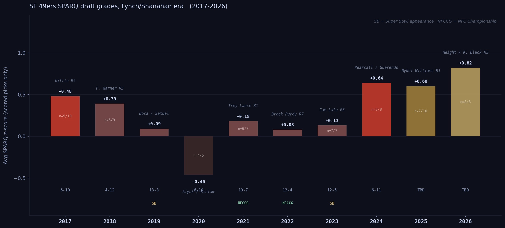

# Nine Drafts, One Standard: The John Lynch Era by the Numbers

*May 1, 2026*

*John Lynch took over as 49ers GM with zero front-office experience. Nine years and ten draft classes later, here's what the combine data says about how he built it — and how it held up.*

---

John Lynch had never worked in an NFL front office when Kyle Shanahan called him in January 2017. He'd just retired from the Fox Sports broadcast booth. The 49ers had gone 2-14 the year before. The roster was essentially bare.

What followed was one of the more interesting roster-building exercises of the modern NFL era. We have SPARQ z-scores — position-adjusted athleticism scores from the NFL combine — for every Lynch draft class from 2017 through 2026. Here's what the data shows, class by class, player by player.

One framing note before we start: draft classes are lagging indicators. The players selected in 2017 didn't determine what happened in 2017 — they determined what happened in 2020 and 2021, once they'd developed. We're evaluating each class by the players it produced, not the season record that year.

---

## The Picture from Above

Eight of ten Lynch-era classes averaged a positive SPARQ z-score. The Lynch-era average across all ten classes: **+0.27**. That's a quarter standard deviation above the league mean, sustained over a decade. The trend has moved upward in the last three years: 2024 (+0.64), 2025 (+0.60), and 2026 (+0.82) are the most athletically tested classes Lynch has assembled.

The one negative class, 2020 at -0.46, had only five picks and no combine because of COVID. Read that number carefully.

---

## 2017: Building the Foundation

*Class avg: +0.48 &nbsp;·&nbsp; 9 of 10 picks scored*

**Solomon Thomas — R1 (#3 overall) — z=+2.32**
The second-highest SPARQ score of any 49ers pick in the Lynch era, and a cautionary tale about what athleticism alone can't tell you. Thomas tested like a freak athlete — elite explosion, elite quickness — but played defensive tackle in a scheme that needed edge-setting 3-techniques, not interior pass rushers. He produced 13 sacks across six professional seasons before retiring in 2024. The number was right; the position was wrong.

**Reuben Foster — R1 (#31 overall) — no combine data**
The other first-round pick. Foster had off-field issues that ended his career before it started. We don't have a SPARQ score. The story ends there.

**George Kittle — R5 (#146 overall) — z=+0.93**
Kittle is the most important pick of the Lynch era. 145 teams passed on him. His SPARQ score is +0.93, driven by agility and explosion numbers that were exceptional for a tight end — exactly the athletic profile required to run routes like a wide receiver and block like a fullback in Shanahan's wide zone system. He went on to become arguably the best tight end in football, with three All-Pro selections through 2025. Lynch and Shanahan found a player whose testing profile matched the exact demands of what they needed. That's the job.

**CJ Beathard — R3 — z=+0.98**
Good athlete, never developed as an NFL starter. Career backup. The SPARQ said he could move; the NFL said he couldn't read a defense.

**Ahkello Witherspoon — R3 — z=+0.51**
Three solid seasons as a starter in San Francisco, then a longer career with Pittsburgh and others. Serviceable, not a star. The testing was roughly right.

**Joe Williams — R4 — z=+0.36**
A running back from Utah who never played a regular-season snap. Cut before the season opened. The SPARQ was fine; the player wasn't ready.

**DJ Jones — R6 — z=+0.32**
The quiet hit of the 2017 class outside of Kittle. Jones was a 3-technique defensive tackle who tested above average and developed into a productive interior lineman. He was disruptive against the run and showed enough pass rush to earn a significant free agent contract with the Raiders in 2021. Lynch found a contributing NFL starter in the sixth round. That's exactly what the late rounds are supposed to do.

**Pita Taumoepenu — R6 — z=+0.22**
An edge rusher who spent time on the practice squad and had a limited professional career.

**Trent Taylor — R5 — z=-0.72**
A slot receiver who tested below average but contributed as a chain-mover for the 49ers for several seasons before injuries caught up with him. Another data point for SPARQ having a floor, not a ceiling.

**Adrian Colbert — R7 — z=-0.60**
A safety who appeared in games for San Francisco and had a journeyman career thereafter.

**Fred Warner — not in this class** (2018)

The 2017 class is Kittle and, to a lesser extent, Jones. Kittle is the superstar find; Jones is the reminder that Lynch has been finding contributing starters in the late rounds from the very first year. Everything else in this class is footnotes.

---

## 2018: The Quiet Class

*Class avg: +0.39 &nbsp;·&nbsp; 6 of 9 picks scored*

**Mike McGlinchey — R1 (#9 overall) — z=+0.44**
A solid, reliable NFL starting tackle for six seasons. Not an elite blocker, but durable and consistent. He hit free agency after 2022 and signed a large deal with Denver. Above average by SPARQ; above average by outcome.

**Dante Pettis — R2 — no data**
A receiver taken 44th overall who was out of the league in three years. No combine data in our set.

**Fred Warner — R3 (#70 overall) — z=+1.00**
This is the pick that defines the 2018 class. Warner's testing profile — z=+1.00 at linebacker — reflected elite athleticism for the position: the speed to run sideline-to-sideline, the explosiveness to blitz off the edge, the agility to cover running backs out of the backfield. He became a three-down linebacker in a system that demands it, and he's been one of the best in the NFL at the position since 2019. Four Pro Bowl selections. He's now a franchise cornerstone. Lynch found him in the third round because almost everyone else underestimated what his athleticism could do in the right system.

**Tarvarius Moore — R3 — z=+0.55**
Spent most of his career on special teams. The SPARQ was there; the position development wasn't.

**DJ Reed — R5 — z=-0.23**
One of the more interesting data points in the Lynch era. Reed tested below average by SPARQ but developed into a Pro Bowl-caliber cornerback — after being released by San Francisco. The 49ers cut him; he found success with Seattle and then the Jets. The miss here isn't in Reed's ability — it's that SF didn't develop him. The number was telling you something. The outcome proved it wasn't the right story.

The 2018 class is Warner. He, alongside Kittle, is the connective tissue of the Lynch era.

---

## 2019: Stars at the Top, Noise at the Bottom

*Class avg: +0.09 &nbsp;·&nbsp; 7 of 8 picks scored*

The +0.09 average looks underwhelming. The distribution tells a different story.

**Nick Bosa — R1 (#2 overall) — z=+1.01**
The best defensive player Lynch has drafted. Bosa's SPARQ score of +1.01 at defensive end reflects genuine elite athleticism — the explosion and quickness to win with a first step, the strength to convert. He came out after just one college season at Ohio State due to a core muscle injury, which scared off nobody in San Francisco. He was Defensive Player of the Year in 2022. He's been one of the best pass rushers in the league in every healthy season he's played.

**Deebo Samuel — R2 (#36 overall) — z=+0.36**
Samuel's SPARQ score is above average but not exceptional — +0.36 puts him in roughly the 60th percentile for wide receivers. What the combine doesn't capture is his physicality after contact and his ability to function as a running back in the open field. He was an All-Pro in 2021. The testing identified an above-average athlete; the scheme unlocked a weapon.

**Dre Greenlaw — R5 — z=+0.23**
Fell to the fifth round as a linebacker from Arkansas. SPARQ slightly above average. He became a starting ILB who graded well in coverage for several seasons before a torn Achilles in 2024. A fifth-round find who gave SF real starter value.

**Jalen Hurd — R3 — z=+0.25**
Taken as a converted wide receiver from Tennessee. Never played a regular-season snap due to injuries. Zero return on a third-round pick.

**Mitch Wishnowsky — R4 — no data**
A punter. Reliable. Not a SPARQ story.

The shape of the 2019 class is everything. Two elite testers in the top 40 picks (Bosa and Samuel), both of whom became franchise cornerstones. The rest of the class is noise. The average is pulled down by late-round developmental picks who didn't pan out. The top of the class is what Lynch was actually doing.

---

## 2020: The Outlier Year

*Class avg: -0.46 &nbsp;·&nbsp; 4 of 5 picks scored*

The combine was canceled due to COVID. Five picks, four with data. Treat this class's number with significant caution.

**Brandon Aiyuk — R1 (#25 overall) — z=+0.23**
Above-average athlete for a wide receiver. He developed slowly in his first two seasons, then broke out into an All-Pro-caliber receiver by 2022-2023, before a contract dispute and trade request in 2024. Whatever happens from here, he was a legitimate hit on the pick — a player whose athleticism translated to elite route running and yards-after-catch production.

**Javon Kinlaw — R1 (#14 overall) — no combine data**
The other first-round pick. Kinlaw had no combine due to COVID. Multiple knee surgeries derailed his career before it began. He never became an NFL factor. The 2020 class lost two first-round picks in terms of real-world value.

**Jauan Jennings — R7 — z=-1.16**
Below average by SPARQ, significantly. He became a low-key contributor and started games for the 49ers in 2023-2024. Low athleticism, high football IQ — the kind of late-round find that the SPARQ framework explicitly doesn't predict. He's the exception that proves the rule, not evidence against it.

**Colton McKivitz — R5 — z=-1.32**
Below average for an offensive tackle. Has been a backup and spot starter for SF for several seasons. The testing was right.

The 2020 class produced Aiyuk, who is a legitimate impact player. Everything else underdelivered. It's the weakest Lynch class by outcome — and also the only one with a negative SPARQ average.

---

## 2021: The Lance Class

*Class avg: +0.18 &nbsp;·&nbsp; 6 of 7 picks scored*

**Trey Lance — R1 (#3 overall) — no combine data**
The defining pick of this class — a quarterback taken third overall for whom we have no combine data. Lance played three games as a starter before a broken ankle in 2022. He was traded to Dallas in 2024 and released shortly after. The Lance pick was a bet on arm talent and mobility that didn't pan out. Whether the missing SPARQ data would have told you anything meaningful is unclear; the outcome was a disaster regardless.

**Elijah Mitchell — R6 — z=+0.92**
The hidden gem of the 2021 class. Mitchell fell to the sixth round despite testing in the 87th percentile of running backs by SPARQ. He became the 49ers' lead back in 2021 and rushed for 963 yards on 207 carries. Injuries (shoulder, knee, finger) have derailed his availability in subsequent seasons, but when healthy, the athleticism has shown up exactly as the testing predicted.

**Talanoa Hufanga — R5 — z=-0.35**
The most interesting data point in the Lynch era. Hufanga tested below average at safety — -0.35 — which explains why he was available in the fifth round. He was a Pro Bowl selection in 2022. He's an instinctive, physical safety whose football IQ and scheme understanding made him into an impact player that the combine couldn't measure. He suffered a torn ACL in 2023 and is working through his comeback. Hufanga is the legitimate counterexample to lean on when arguing SPARQ has limits — which it does.

**Deommodore Lenoir — R5 — z=-0.39**
Another below-average SPARQ score, another fifth-round pick. Lenoir has developed into a reliable starting cornerback for San Francisco. He's not an elite athlete. He's football-smart and technically sound. Same story as Hufanga: the combine didn't capture what he brought.

**Trey Sermon — R3 — z=+0.59**
Good SPARQ, gone in a year. Running back depth in the NFL is volatile; Sermon never got consistent opportunity before being cut.

The 2021 class tells a split story. The big-ticket pick (Lance) was a bust. The back half of the class — Mitchell, Hufanga, Lenoir — produced real contributors. Two of those three (Hufanga, Lenoir) tested below average by SPARQ and became starters. The NFL is full of exceptions; a single class can contain several.

---

## 2022: Thin by Design

*Class avg: +0.08 &nbsp;·&nbsp; 5 of 8 picks scored*

San Francisco traded away significant future capital to move up for Trey Lance in 2021, which limited what they could do in 2022. Five scored picks out of eight, none of them particularly high-upside athletes.

**Drake Jackson — R2 — no data**
Taken as an edge rusher, has been limited as a pass rusher in his first few professional seasons. No combine data in our system.

**Tyrion Davis-Price — R3 — z=+0.03**
A running back who was released after two seasons and hasn't found an NFL home since.

**Danny Gray — R3 — z=-0.06**
A speed receiver who tested below average. Has had limited NFL opportunity.

**Nick Zakelj — R6 — z=+0.56**
A backup offensive tackle who has held a roster spot and occasionally started.

The 2022 class is the thinnest of the Lynch era, both by data and by production. It reflects the cost of the Lance trade — fewer picks, less flexibility, a compressed class. The one significant player from this class is a quarterback, and SPARQ doesn't apply to quarterbacks.

---

## 2023: Rebuilding the Depth Chart

*Class avg: +0.13 &nbsp;·&nbsp; 7 of 7 picks scored*

**Cameron Latu — R3 — z=-0.39**
A tight end from Alabama with below-average SPARQ who has had a limited role in the San Francisco offense through his first two seasons. The testing suggested developmental upside rather than immediate production; the on-field results have matched.

**Darrell Luter — R5 — z=+0.17**
A cornerback who tested above average and has spent most of his time on the practice squad and injured reserve. The athleticism is there; the availability hasn't been.

**Robert Beal — R5 — z=+0.14**
An edge rusher who has had limited pass rush production in his first two seasons.

**Dee Winters — R6 — z=+0.42**
A linebacker with modest athleticism who has been a special teams contributor.

**Brayden Willis — R7 — z=+0.78**
Tested well for a tight end at the bottom of the draft. Has appeared in games for SF as a blocking TE.

**Ronnie Bell — R7 — z=+0.10**
A receiver who has been on the practice squad and contributed on special teams.

**Jalen Graham — R7 — z=-0.34**
A linebacker with below-average testing who has spent time on the practice squad.

Entering year three, this class has not produced a contributor. Cameron Latu, the highest-round pick, has not broken through as a tight end — year three is typically when TEs either establish themselves or get replaced. None of the other picks have claimed a meaningful role on the active roster. The one thing that stands out in the data: 7 of 7 picks scored, full combine coverage in a depth-building year. Lynch drafted measurable athletes. The development hasn't followed.

---

## 2024: The High-Water Mark (So Far)

*Class avg: +0.64 &nbsp;·&nbsp; 8 of 8 picks scored*

The best Lynch class by SPARQ average, and it has the data to back it up — eight picks, all scored.

**Ricky Pearsall — R1 (#31 overall) — z=+0.97**
A wide receiver who tested in the top 20% of the position. His rookie season was derailed by a preseason shooting incident and subsequent recovery, limiting him to nine games. The athleticism is genuine; the career arc is unwritten.

**Isaac Guerendo — R4 — z=+1.58**
The most athletic player in the 2024 class. Guerendo, a running back from Wisconsin, tested in the 91st percentile of the position. He showed real burst in his rookie season and appears positioned to compete for carries. High-SPARQ backs who fall to the fourth round often do so because of injury history or college usage concerns. Worth tracking.

**Malik Mustapha — R4 — z=+1.37**
A safety from Wake Forest who tested in the 88th percentile at the position. Physically, exactly the kind of rangy, explosive player the Lynch era has consistently targeted at linebacker and safety.

**Dominick Puni — R3 — z=+0.60**
An interior lineman with above-average athleticism for a guard. Started games as a rookie. Showing promise.

**Renardo Green — R2 — z=-0.01**
A cornerback who tested at almost exactly average. His rookie season was limited. Too early to evaluate.

**Jacob Cowing — R4 — z=-0.40**
A slot receiver who tested below average. Limited NFL opportunity so far.

**Tatum Bethune — R7 — z=-0.59**
A linebacker with below-average testing, spending time as a developmental piece.

**Jarrett Kingston — R6 — z=+1.58**
Tied with Guerendo for the highest SPARQ in the class. An offensive lineman who tested explosively and is developing on the practice squad. Sometimes the athleticism shows up in unexpected places; this is one to watch.

The 2024 class is early-stage. But eight picks with eight data points, three of them in the top 10-15% of their positions athletically — this is what deliberate drafting looks like.

---

## 2025 and 2026: The Reload

**2025** averaged +0.60 across seven scored picks. The headline pick — Mykel Williams, an edge rusher from Georgia taken in the first round — has no combine data due to injury, which means the true average may be higher. Nick Martin (R3, +1.48) and CJ West (R4, +1.30) are the class's standout testers with data.

**2026** is the highest-SPARQ class Lynch has ever assembled: **+0.82** across all eight picks, with zero missing data. Romello Height (R3, +1.20), Kaelon Black (R3, +1.41), Gracen Halton (R4, +1.18), and Enrique Cruz Jr. (R5, +1.76) are all in the top 20-30% of their positions athletically. The 49ers drafted a full class with every combine metric in hand and picked athletes up and down the board. That's deliberate.

---

## The Pattern

Ten years in, a few things are clear.

Lynch has consistently found high-SPARQ players who fit the Shanahan scheme at positions that reward athleticism: tight end, linebacker, pass rusher, safety. Kittle (+0.93), Warner (+1.00), Bosa (+1.01), Mitchell (+0.92 when healthy), Martin (+1.48). The athletic profile Lynch targets at these positions is real and repeatable.

He has also had high-SPARQ picks that didn't work out — Thomas (+2.32) because of position fit, Sermon (+0.59) because of opportunity, various others who didn't develop. SPARQ identifies athleticism. It doesn't guarantee outcomes. What Lynch has done is make athleticism a consistent entry requirement, not a guarantee of selection.

The genuine counterexamples — Hufanga (-0.35), Lenoir (-0.39), Jennings (-1.16) — are real. The Lynch era is not a pure athleticism story. Late-round picks are always developmental and often selected on film rather than testing. What the SPARQ data shows is that the top of Lynch's boards, the picks that are supposed to become starters, have tested well with high consistency.

The 2024-2026 classes represent something new: an attempt to combine high SPARQ averages with complete data coverage. Zero missing picks in 2026 is a statement. Lynch has drafted full classes before (2023 was also complete), but never at this athleticism level. Whether those classes follow the Kittle/Warner/Bosa pattern or the Thomas/Lance pattern is what the next three years will answer.

---

**See every prospect's SPARQ score, draft slot, and percentile rank at [not-in-scope.github.io/nfl-sparq/](https://not-in-scope.github.io/nfl-sparq/)**

---

*Data: SPARQ z-scores from BigBoardLab, MockDraftable, and PFF pro day tracking. All 2017-2026 SF draft classes. Lynch-era average (+0.27) weighted equally across all ten classes. Player career summaries reflect performance through the 2024 NFL season.*
