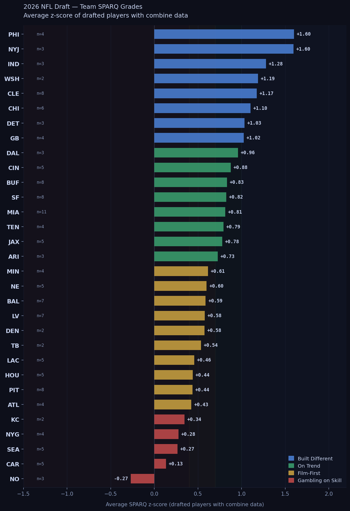

# Every Team's 2026 Draft Class, Ranked by Athleticism

*May 1, 2026*

*We ran the SPARQ numbers on all 257 picks. Here's where every team stands.*

---

The tape evaluation is done. The war rooms are empty. Now comes the part where everyone argues about who won the draft — usually based on vibes, positional needs, and whatever the local beat reporter thinks.

Here's a different cut: which teams actually drafted athletes?

We pulled SPARQ z-scores for every player in the 2026 draft class and averaged them by team. SPARQ combines seven combine metrics — speed, explosion, strength, agility — into a single number adjusted by position. A z-score of zero is exactly average for the position. Positive means above average. Negative means below.

One caveat up front: 36% of drafted players don't have SPARQ data, either because they skipped the combine, didn't test in every drill, or came from programs with limited pro day tracking. Teams with mostly null-SPARQ classes are harder to evaluate — we note sample sizes throughout. The full methodology is in our [first post](../low-sparq-nfl-success/).

---

## The Full Rankings

---

## Built Different (z > 1.0)

These eight teams drafted players who test in the top third of NFL athletes at their positions.

**Philadelphia Eagles — +1.60 (n=4 scored picks)**
The Eagles lead the board, though with four scored picks out of seven total, read this number carefully. Their measurable class includes some high-end testers. Philadelphia's front office has a long track record of prioritizing athletic ceilings — this draft continues that pattern.

**New York Jets — +1.60 (n=3 scored picks)**
Essentially tied with Philly, driven heavily by Kenyon Sadiq (z=+2.95, 99.8th percentile) — the highest SPARQ score of anyone taken in the 2026 draft. Three scored picks out of eight means the Jets' number is volatile. What's not volatile: Sadiq is a legitimately rare athlete at a position that increasingly rewards it.

**Cleveland Browns — +1.17 (n=8 scored picks)**
Cleveland is the team you should actually trust at the top of this list. Eight scored picks with only two nulls is the best data quality of any team in the top ten. The Browns didn't just get lucky with one elite tester — they built an athletically consistent class across multiple rounds.

**Indianapolis Colts — +1.28 (n=3) | Washington Commanders — +1.19 (n=2)**
Both strong numbers, both small samples. Washington's two scored picks include Sonny Styles at z=+2.34. Treat these as directionally interesting rather than conclusive.

**Chicago Bears — +1.10 (n=6 scored picks)**
Chicago rounds out the Built Different tier with the second-best data quality in this group. Six scored picks, one null. The Bears drafted athletes up and down the board, which fits their rebuild around speed and youth.

**Detroit Lions — +1.03 (n=3) | Green Bay Packers — +1.03 (n=4)**
Both NFC North teams clear the threshold cleanly. The NFC North is quietly building itself into the most athletically-drafted division in 2026 — Detroit, Green Bay, and Chicago all land in the top eight.

---

## On Trend (0.70 to 1.0)

Eight teams drafted above-average athletes across their classes. Nothing surprising here — this is where most well-run front offices should land in any given year.

**Dallas Cowboys — +0.96 | Cincinnati Bengals — +0.88 | Buffalo Bills — +0.83**
Three teams with enough sample sizes to trust. Dallas and Cincinnati had three and five scored picks respectively. Buffalo's eight scored picks (one null) give them the most reliable number in this tier.

**San Francisco 49ers — +0.82 (n=8, zero nulls)**
SF is the only team in the entire draft with a fully measured class — eight scored picks, zero missing data. That's worth noting. The 49ers' number is exactly what it says: a clean, above-average athletic class across the board.

**Miami Dolphins — +0.82 (n=11 scored picks)**
Miami made 13 picks and 11 have data. Large, well-measured class that consistently tested above average. Dolphins get credit for both the volume and the quality.

**Tennessee Titans — +0.79 (n=4) | Jacksonville Jaguars — +0.78 (n=5) | Arizona Cardinals — +0.73 (n=3)**
All solidly above average, with Tennessee's number clouded by four nulls in an eight-pick class.

---

## Film-First (0.40 to 0.70)

Ten teams landed here. These front offices drafted players whose film justified the pick regardless of testing. Some of this is philosophy; some of it is position — quarterbacks and offensive linemen in particular test more variably.

**Minnesota Vikings — +0.62 | New England Patriots — +0.60 | Baltimore Ravens — +0.59**
All three are measured, competent classes without standout athletes. Baltimore's four nulls in an eleven-pick class mean some of their class is untested.

**Las Vegas Raiders — +0.58 | Denver Broncos — +0.58**
Denver's number comes from just two scored picks in a six-pick class — treat with caution.

**Tampa Bay Buccaneers — +0.54 (n=2)**
Two scored picks. Directional at best.

**Los Angeles Chargers — +0.46 | Houston Texans — +0.44 | Pittsburgh Steelers — +0.44 | Atlanta Falcons — +0.43**
All measured reasonably well (4-8 scored picks each). Pittsburgh's eight scored picks and one null give them the most reliable Film-First number. The Steelers drafted solid athletes — just not elite ones.

---

## Gambling on Skill (below 0.40)

Five teams (plus the Rams, who had too few scored picks to rank) drafted classes that tested below the league average once you account for position. Whether that's a problem depends entirely on what they saw on film.

**Kansas City Chiefs — +0.35 (n=2, five nulls)**
The Chiefs' number is the least reliable in the bottom tier — two scored picks out of seven total. Five missing data points means we can't really characterize what Kansas City drafted athletically. What we can say: the picks we can measure averaged below-average testing.

**New York Giants — +0.28 (n=4) | Seattle Seahawks — +0.27 (n=5)**
Seattle is the second team with zero nulls — five scored picks, all measured, all below average. This isn't a data problem. The Seahawks drafted a below-average athletic class and we can say that with confidence.

**Carolina Panthers — +0.13 (n=5)**
Lowest of the reasonably-measured teams. Monroe Freeling (OT, z=+1.60) is the bright spot. The rest of the class tested poorly.

**New Orleans Saints — -0.27 (n=3, five nulls)**
The only team with a negative average. Three scored picks in an eight-pick class, five missing. New Orleans either actively avoided the combine process or drafted players whose testing data wasn't available. Either way, the Saints are the outlier.

**Los Angeles Rams — not ranked**
One scored pick out of four total. Insufficient data.

---

## What This Does and Doesn't Tell You

A high team SPARQ average doesn't mean a good draft. It means the players selected tested well. Whether they can play is a different question entirely, and one our database will take three to five seasons to answer properly.

What the historical data does show — from 2,340 picks across 2010 to 2020 — is that SPARQ predicts impact starter rates. High-SPARQ players become three-year starters at a 74% rate in the first two rounds, versus 61% for low-SPARQ players at the same draft positions. That gap holds in the middle rounds too.

Teams near the top of this list drafted more players who, historically, test like impact starters. Teams near the bottom drafted more players who, historically, test like developmental projects or backups. Film and coaching can move any individual player's outcome. The aggregate numbers don't lie.

Check back in 2029.

---

**See every prospect's SPARQ score, draft slot, and percentile rank at [not-in-scope.github.io/nfl-sparq/](https://not-in-scope.github.io/nfl-sparq/)**

---

*Data: 2026 NFL Draft, 257 total picks. SPARQ z-scores available for 173 players (64%). Scores sourced from BigBoardLab, MockDraftable, and PFF pro day tracking. Teams ranked by average z-score among players with data; minimum 2 scored picks to appear. LAR excluded (1 scored pick). Data quality varies by team — sample sizes noted throughout.*
